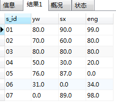
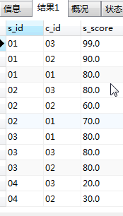

# 50 道 SQL 练习题

## 数据表介绍

1. 学生表
    Student(s_id, s_name, s_age, s_sex)
    -- s_id 学生编号, s_name 学生姓名, s_age 出生年月, s_sex 学生性别
2. 课程表
    Course(c_id, c_name, t_id)
    --  c_id 课程编号, c_name 课程名称, t_id 教师编号
3. 教师表
    Teacher(t_id, t_name)
    -- t_id 教师编号, t_name 教师姓名
4. 成绩表
    Score(s_id, c_id, s_score)
    -- s_id 学生编号, c_id 课程编号, s_score 分数

## 数据初始化

### 学生表 Student
```sql
create table Student(
    s_id varchar(10) comment '学生编号', 
    s_name varchar(10) comment '学生姓名', 
    s_birth datetime comment '出生年月', 
    s_sex varchar(10) comment '性别'
);
insert into Student values('01' , '赵雷' , '1990-01-01' , '男');
insert into Student values('02' , '钱电' , '1990-12-21' , '男');
insert into Student values('03' , '孙风' , '1990-12-20' , '男');
insert into Student values('04' , '李云' , '1990-12-06' , '男');
insert into Student values('05' , '周梅' , '1991-12-01' , '女');
insert into Student values('06' , '吴兰' , '1992-01-01' , '女');
insert into Student values('07' , '郑竹' , '1989-01-01' , '女');
insert into Student values('09' , '张三' , '2017-12-20' , '女');
insert into Student values('10' , '李四' , '2017-12-25' , '女');
insert into Student values('11' , '李四' , '2012-06-06' , '女');
insert into Student values('12' , '赵六' , '2013-06-13' , '女');
insert into Student values('13' , '孙七' , '2014-06-01' , '女');
```

### 科目表 Course
```sql
create table Course(
    c_id varchar(10) comment '课程编号', 
    c_name nvarchar(10) comment '课程名称', 
    t_id varchar(10) comment '教师编号'
);
insert into Course values('01' , '语文' , '02');
insert into Course values('02' , '数学' , '01');
insert into Course values('03' , '英语' , '03');
```

### 教师表 Teacher
```sql
create table Teacher(
    t_id varchar(10) comment '教师编号', 
    t_name varchar(10) comment '教师姓名'
);
insert into Teacher values('01' , '张三');
insert into Teacher values('02' , '李四');
insert into Teacher values('03' , '王五');
```

### 成绩表 Score
```sql
create table Score(
    s_id varchar(10) comment ' 学生编号', 
    c_id varchar(10) comment '课程编号', 
    s_score decimal(18,1) comment '学生成绩'
);
insert into Score values('01' , '01' , 80);
insert into Score values('01' , '02' , 90);
insert into Score values('01' , '03' , 99);
insert into Score values('02' , '01' , 70);
insert into Score values('02' , '02' , 60);
insert into Score values('02' , '03' , 80);
insert into Score values('03' , '01' , 80);
insert into Score values('03' , '02' , 80);
insert into Score values('03' , '03' , 80);
insert into Score values('04' , '01' , 50);
insert into Score values('04' , '02' , 30);
insert into Score values('04' , '03' , 20);
insert into Score values('05' , '01' , 76);
insert into Score values('05' , '02' , 87);
insert into Score values('06' , '01' , 31);
insert into Score values('06' , '03' , 34);
insert into Score values('07' , '02' , 89);
insert into Score values('07' , '03' , 98);
```

## 数据验证

1. 查询一下课程表，预览创建数据和原始数据是否一样（数据简单，直接查看对比，就能知道是否正确）
```sql
select * FROM Course
```
查看后确认数据一样。  

2. 查询一下成绩表，预览创建数据和原始数据是否一样
```sql
select * FROM Score
```
查看后确认数据一样。  

3. 查询一下学生表，预览创建数据和原始数据是否一样
```sql
select * FROM Student
```
查看后确认数据一样。  

4. 查询一下老师表，预览创建数据和原始数据是否一样
```sql
select * FROM Teacher
```
查看后确认数据一样。   

5. 确定数据没有问题，开始练习。  


# 练习题

## 查询" 01 "课程比" 02 "课程成绩高的学生的信息及课程分数  
```sql
SELECT
  st.*,
  t.01_course,
  t.02_course
FROM (
SELECT 
-- 查出01课程与02课程的全部成绩
 s_id,
  SUM(CASE WHEN c_id = '01' THEN s_score ELSE 0 END) AS 01_course,
  SUM(CASE WHEN c_id = '02' THEN s_score ELSE 0 END) AS 02_course
FROM Score
GROUP BY s_id
) AS t
JOIN Student AS st
  ON st.s_id = t.s_id
WHERE t.01_course > t.02_course
```

## 查询同时存在" 01 "课程和" 02 "课程的情况
```sql
SELECT
  *
FROM (
SELECT 
 s_id,
  SUM(CASE WHEN c_id = '01' THEN s_score END) AS 01_course,
  SUM(CASE WHEN c_id = '02' THEN s_score END) AS 02_course
FROM Score
GROUP BY s_id
) AS t
WHERE 01_course IS not NULL AND 02_course IS not NULL
```

## 查询存在" 01 "课程但可能不存在" 02 "课程的情况(不存在时显示为 null )
```sql
SELECT
  *
FROM (
SELECT 
 s_id,
  SUM(CASE WHEN c_id = '01' THEN s_score END) AS 01_course,
  SUM(CASE WHEN c_id = '02' THEN s_score END) AS 02_course
FROM Score
GROUP BY s_id
) AS t
WHERE 01_course IS not NULL 
```

## 查询平均成绩大于等于 60 分的同学的学生编号和学生姓名和平均成绩
第一种做法：
```sql
SELECT 
  sc.s_id as s_id,
  st.s_name as s_name,
  ROUND(AVG(sc.s_score),2) as s_score
FROM Score as sc
JOIN Student as st
  on sc.s_id = st.s_id
GROUP BY sc.s_id, st.s_name
HAVING ROUND(AVG(sc.s_score),2) >= 60
ORDER BY sc.s_id
```
意思：每个学生的平均成绩大于等于60，就获取他的学生信息。  
思路：
1. FROM Score as sc  
JOIN Student as st  
查询 Score 和 Student 表  

2. JOIN Student as st  
	on sc.s_id = st.s_id   
当sc.s_id 相等于 st.s_id 相等时，join 表Score 和 表Student，并且重命名为sc,st。

3. GROUP BY st.s_name, sc.s_id   
按st表姓名及sc表学生ID（一对一关系） 分组。

4. HAVING ROUND(AVG(sc.s_score), 2) >= 60   
注意：HAVING语句通常与GROUP BY语句联合使用，用来过滤由GROUP BY语句返回的记录集。筛选出成绩平均分大于等于60的。

第二种做法：
```sql
SELECT 
  st.*,
  t.`平均成绩`
FROM (
SELECT 
-- 查询成绩大于60的学生ID及平均成绩
  s_id,
  ROUND(AVG(s_score),2) AS 平均成绩
FROM Score
GROUP BY s_id
HAVING ROUND(AVG(s_score),2) >= 60
) as t
JOIN Student as st
  ON st.s_id = t.s_id
```

## 查询在 Score 表存在成绩的学生信息
```sql
select 
 st.s_id as s_id, 
 st.s_name as s_name, 
 st.s_birth as s_birth, 
 st.s_sex as s_sex,
 t.s_score
FROM(
  SELECT 
  s_id,  
  sum(s_score) as s_score
  FROM Score 
  GROUP BY s_id
) as t
join Student as st
  on t.s_id = st.s_id 
```
意思：就是查询有成绩的学生的信息  
思路：
1. 查询成绩表
2. 按学生ID 分组
3. 获取学生ID 及总成绩（为啥查总成绩：因为按学生ID 分组后，每个学生对应好几个成绩。）
4. 将得到的信息重命名为t
5. t 表和 Student 表join。
6. 获取 s_id,  s_name, s_birth, s_sex, s_score  

## 查询在 Score 表不存在成绩的学生信息
```sql
SELECT  
  st.s_id as s_id,
  st.s_name as s_name,
  st.s_birth as s_birth,
  st.s_sex as s_sex,
  sc.s_score as s_score
FROM Score as sc
RIGHT JOIN Student as st
  on sc.s_id = st.s_id
WHERE sc.s_score IS null 
```
思路：查所有学生中成绩信息，排除有成绩的学生信息。
1. 查询所有学生的信息，及对应的学生成绩。（right join 以右表 Student表为主。不论成绩表是否有成绩，有一个学生就显示一个成绩。如果没有成绩，会显示为空null）
2. 当成绩表中 s_score 为 null 时
3. 获取s_id, s_name, s_birth, s_sex, s_score 字段信息。

## 查询所有同学的学生编号、学生姓名、选课总数、所有课程的总成绩(没成绩的显示为 null )
```sql
select 
  st.s_id as s_id, 
  st.s_name as s_name, 
  st.s_birth as s_birth, 
  st.s_sex as s_sex,
  t.s_score,
	t.c_id 
FROM(
  SELECT 
  s_id,  
  COUNT(c_id) as c_id, 
  sum(s_score) as s_score
  FROM Score 
  GROUP BY s_id
) as t
RIGHT join Student as st
  on t.s_id = st.s_id 
```

## 查询「李」姓老师的数量
```sql
SELECT 
  COUNT(t_name) as t_n_cnt
FROM Teacher
WHERE t_name LIKE '李%'
```

## 查询学过「张三」老师授课的同学的信息
第一种做法：  
```sql
SELECT 
  st.s_id as s_id, 
  st.s_name as s_name,
  st.s_birth as s_birth,
  st.s_sex as s_sex,  
  co.c_name as c_name, 
sc.s_score as s_score
FROM Score as sc 
JOIN Course as co
  ON co.c_id = sc.c_id 
JOIN Student as st
  ON sc.s_id = st.s_id
join Teacher as te
  ON te.t_id = co.t_id
WHERE te.t_name = '张三'
```
第二种做法：  
```sql
select
  t.s_id as s_id,
  st.s_name as s_name,
  st.s_sex as s_sex,
  st.s_birth as s_birth
from (
	-- 获取 张三 老师下的 s_id（学生编号），并且去重
SELECT 
  sc.s_id as s_id
FROM Score as sc 
JOIN Course as co
  ON co.c_id = sc.c_id
join Teacher as te
  ON te.t_id = co.t_id
WHERE te.t_name = '张三'
GROUP BY sc.s_id
) as t
join Student as st
  on t.s_id = st.s_id
```
想法：得到张三老师下学生 id，去join学生表，得到需要的信息。  
第三种做法：  
```sql
SELECT 
	t.*,
  st.s_name as s_name,
  st.s_birth as s_birth,
  st.s_sex as s_sex
 FROM (
		SELECT 
			sc.s_id as s_id,
      sc.s_score as s_score
		FROM Score as sc, Course AS co, Teacher AS te
		WHERE sc.c_id = co.c_id AND co.t_id = te.t_id AND te.t_name = '张三'
) AS t
JOIN Student AS st
ON st.s_id = t.s_id
```

## 查询没有学全所有课程的同学的信息
```sql
SELECT 
  st.s_id,
  st.s_name,
  st.s_birth,
  st.s_sex
FROM (
	SELECT 
  -- 得到没有学全所有课程的学生id和课程数
	  sc.s_id,
	  COUNT(sc.c_id) as c_id_cnt
	FROM Score as sc
	GROUP BY sc.s_id
	HAVING COUNT(sc.c_id) < (
	  SELECT COUNT(c_id) FROM Course
	)
) as t
join Student as st 
on st.s_id = t.s_id 
```
思路：求出每个学生有几门课程，和总课程相比较，当学生课程数小于总课程数则获取他的s_id和学了几门课程数，最后和学生表join，等到学生信息。  

## 查询至少有一门课与学号为" 01 "的同学所学相同的同学的信息
```sql
select * 
from Student AS st 
where st.s_id 
in (
-- 查询上过这几门课程的学生ID
select s_id from Score where c_id 
in(
-- 查询学生01所学的所有课程,in(包含)
 select c_id from Score where s_id = '01'
    )
)
```

## 查询和" 01 "号的同学学习的课程 完全相同的其他同学的信息
```sql
select st.* from Student AS st where st.s_id 
in(
  select 
    s_id 
  from Score 
  where s_id!='01' 
  and c_id in(select c_id from Score where s_id='01' )
group by s_id 
having count(c_id)=(select count(c_id) from Score where s_id='01'))
```
思路：  
1. 查询学生 01上的课程ID 
```sql
select c_id from Score where s_id='01'    
```
2. 查询除了学生01，并且满足课程ID 在(select c_id from Score where s_id='01' )包含中。也就是查找除了学生01，而且满足上了三门课程任意一门课程的学生ID
```sql
  select  s_id from Score   
  where s_id!='01'   
  and c_id in(select c_id from Score where s_id='01' )  
```
3. 按学生ID分组
```sql
group by s_id
```
4. 查询学生01 课程的总数，如果其他的学生的课程总数与学生01 课程总数相等，则留下；其他不相等的就过滤掉。
```sql
having count(c_id)=(select count(c_id) from Score where s_id='01') 
```
5. 查询学生表，当学生表的学生ID 和 查出前四步查出的学生ID一样，则获取此学生id的信息。
```sql
select st.* from Student AS st where st.s_id 
in(
```

## 查询没学过"张三"老师讲授的任一门课程的学生姓名
```sql
SELECT
  st.s_id,
  st.s_name,
  st.s_birth,
  st.s_sex
FROM (
	SELECT
  -- 获取 张三 老师下的 s_id（学生编号），并且去重
		sc.s_id
	FROM Score AS sc
	JOIN Course AS co
		ON sc.c_id = co.c_id 
	JOIN Teacher as te
		ON te.t_id = co.t_id
	WHERE te.t_name = '张三'
	GROUP BY sc.s_id
) AS t
RIGHT JOIN Student AS st
 ON st.s_id = t.s_id
WHERE t.s_id IS NULL
```

## 查询两门及其以上不及格课程的同学的学号，姓名及其平均成绩
```sql

```

## 检索" 01 "课程分数小于 60，按分数降序排列的学生信息
```sql
SELECT 
  st.s_id,
  t.s_score,
  st.s_name,
  st.s_birth,
  st.s_sex
FROM(
-- 01课程小于60的学生ID
  SELECT 
    sc.s_id as s_id,
    sc.s_score as s_score
  FROM Score as sc
  JOIN Course as co
    on sc.c_id = co.c_id
  WHERE sc.c_id = '01' AND s_score < 60
)as t
join Student as st
  ON t.s_id = st.s_id
ORDER BY t.s_score DESC
```

## 按平均成绩从高到低显示所有学生的所有课程的成绩以及平均成绩
```SQL
SELECT
  s_id,
  -- 每门课成绩
  sum(case when c_id = '01' then s_score ELSE 0 end) as 语文,
  sum(case when c_id = '02' then s_score ELSE 0 end) as 数学,
  sum(case when c_id = '03' then s_score ELSE 0 end) as 外语,
  ROUND(AVG(s_score),2) as 平均成绩
FROM Score 
GROUP BY s_id 
ORDER BY ROUND(AVG(s_score),2) DESC
```
目标：
1. 查询 Score 表
2. 通过 GROUP BY s_id ，对学生 id 进行分组，由原来的一个学生对于三条信息，转换为一个学生一条信息
3. 获取学生 id
4. case when 条件 then 结果 else 0 end  意思是当满足条件时，显示结果，不满足则显示为0（默认不满足条件显示为null），结束
5. sum 聚合函数 SUM(col)返回指定列的所有值之和。如果出现一个学生同一门课程考试两次，sum对指定的进行求和，数据显示出来会出现不符合实际的情况。假如满分是100分，最后显示出某一位同学成绩大于100，则有问题，使用 sum 可以帮助发现问题。

## 原始数据是

### 转化完的数据

## 列转行
```sql
SELECT
  t.s_id,
  '01' as c_id,
  yw as s_score
-- 查询学生01-07的语文课程
FROM (
  -- 这个练习只有一个 t 表
  SELECT
    s_id,
    sum(case when c_id = '01' then s_score ELSE 0 end) yw,
    sum(case when c_id = '02' then s_score ELSE 0 end) sx,
    sum(case when c_id = '03' then s_score ELSE 0 end) eng
  FROM Score 
  GROUP BY s_id  
) as t
UNION ALL
SELECT
  t.s_id,
  '02' as c_id,
  sx
-- 查询学生01-07的数学课程
FROM (
 SELECT
    s_id,
    sum(case when c_id = '01' then s_score ELSE 0 end) yw,
    sum(case when c_id = '02' then s_score ELSE 0 end) sx,
    sum(case when c_id = '03' then s_score ELSE 0 end) eng
  FROM Score 
  GROUP BY s_id   
) as t
UNION ALL
SELECT
  t.s_id,
  '03' as c_id,
  eng
-- 查询学生01-07的英语课程
FROM (
	 SELECT
    s_id,
    sum(case when c_id = '01' then s_score ELSE 0 end) yw,
    sum(case when c_id = '02' then s_score ELSE 0 end) sx,
    sum(case when c_id = '03' then s_score ELSE 0 end) eng
  FROM Score 
  GROUP BY s_id  
) as t
ORDER BY s_id
```
学习：
1. sum 函数

2. UNION ALL 与 UNION 区别： UNION(或称为联合)的作用是将多个结果合并在一起显示出来。

3. Union因为要进行重复值扫描，所以效率低。如果合并没有刻意要删除重复行，那么就使用Union All

4. 两个要联合的SQL语句 字段个数必须一样，而且字段类型要“相容”（一致）；   

5. Union：对两个结果集进行并集操作，不包括重复行，同时进行默认规则的排序；     

6. Union All：对两个结果集进行并集操作，包括重复行，不进行排序；   

## 查询各科成绩最高分、最低分和平均分
```sql
SELECT 
  sc.c_id as c_id,
  MAX(s_score) as s_sc_max,
  MIN(s_score) as s_sc_min,
  ROUND(AVG(s_score),2) as s_sc_avg
FROM Score as sc
join Course as co
  on sc.c_id = co.c_id
GROUP BY sc.c_id
```

## 以如下形式显示：课程 ID，课程 name，最高分，最低分，平均分，及格率，中等率，优良率，优秀率,及格为: >=60，中等为：70-80，优良为：80-90，优秀为：>=90 , 要求输出课程号和选修人数，查询结果按人数降序排列，若人数相同，按课程号升序排列
```SQL
SELECT 
  sc.c_id AS c_id, -- 课程ID
  co.c_name AS 课程name,
  MAX(sc.s_score) AS 最高分,
  MIN(sc.s_score) AS 最低分,
  ROUND(AVG(sc.s_score),2) AS 平均分,
  ROUND(100*(SUM(CASE WHEN sc.s_score >= 60 THEN 1 ELSE 0 END)/SUM(1)),2) AS 及格率,
  ROUND(100*(SUM(CASE WHEN sc.s_score >= 70 AND sc.s_score <= 80  THEN 1 ELSE 0 END)/SUM(1)),2) AS 中等率,
  ROUND(100*(SUM(CASE WHEN sc.s_score >= 80 AND sc.s_score <= 90  THEN 1 ELSE 0 END)/SUM(1)),2) AS 优良率,
  ROUND(100*(SUM(CASE WHEN sc.s_score >= 90 THEN 1 ELSE 0 END)/SUM(1)),2) AS 优秀率,
  COUNT(sc.s_id) AS c_s_cnt
FROM Score AS sc
LEFT JOIN Course AS co
ON sc.c_id = co.c_id
GROUP BY sc.c_id, co.c_name
ORDER BY c_s_cnt DESC, c_id ASC
```

## 按各科成绩进行排序，并显示排名， Score 重复时保留名次空缺
```sql
select 
  a.c_id, 
  a.s_id, 
  a.s_score, 
  count(b.s_score)+1 as rank
from Score as a 
left join Score as b 
on a.s_score < b.s_score and a.c_id = b.c_id
group by a.c_id, a.s_id,a.s_score
order by a.c_id, rank ASC;
```
##  按各科成绩进行排序，并显示排名， Score 重复时合并名次

## 查询学生的总成绩，并进行排名，总分重复时不保留名次空缺
```sql
set @crank=0;
select 
  q.s_id, 
  q.s_score, 
  @crank := @crank +1 as rank 
from(
	select 
		sc.s_id, 
		sum(s_score) as s_score 
	 from Score as sc
	group by s_id
	order by s_score desc
) AS q;
```

## 查询各科成绩前三名的记录
```sql
SELECT
  a.*
FROM (
		SELECT 
			t.s_id,
			t.s_score,
			IF(@pa=t.c_id, @rownumber:=@rownumber+1, @rownumber:=1) AS rownumber,
			@pa:=t.c_id AS c_id
		from (
				SELECT 
					s_id,
					c_id,
					s_score
				FROM Score
				ORDER BY c_id ASC,s_score DESC
		) AS t, (SELECT @pa:=0, @rownumber:=0 ) AS b
		) AS a
WHERE rownumber <= 3
```

## 查询每门课程被选修的学生数
```sql
SELECT 
  c_id,
  COUNT(s_id) as s_id_cnt
FROM 
Score
GROUP BY c_id
```

## 查询出只选修两门课程的学生学号和姓名
```sql
SELECT 
  st.s_id,
  st.s_name,
  st.s_birth,
  st.s_sex
FROM (
	SELECT
		s_id,
		COUNT(c_id) as c_id_cnt
	FROM Score 
	GROUP BY s_id
	HAVING COUNT(c_id) = 2
) as t
JOIN Student as st
  ON st.s_id = t.s_id
```

## 查询男生、女生人数
```sql
SELECT 
  s_sex,
  COUNT(s_sex) as s_sex_cnt
FROM
Student
GROUP BY s_sex
```

## 查询名字中含有「风」字的学生信息
```sql
SELECT s_name FROM Student WHERE s_name like '%风%'
```

## 查询同名同性学生名单，并统计同名人数
第一种方法：  
```SQL
select 
  a.s_name,
  a.s_sex,
  count(*) 
from Student a  
JOIN Student b 
on a.s_id !=b.s_id and a.s_name = b.s_name and a.s_sex = b.s_sex
GROUP BY a.s_name,a.s_sex
```
第二种方法：  
```SQL
select 
  a.s_name,
  a.s_sex,
  count(*) 
from Student a  
-- 只在一张表内查询，统计按照姓名性别分组，次数大于1，也就是存在同名同姓的情况
GROUP BY a.s_name,a.s_sex
HAVING count(*) > 1
```

## 查询 1990 年出生的学生名单
```sql
SELECT s_name FROM Student WHERE s_birth LIKE '1990%'
```

## 查询每门课程的平均成绩，结果按平均成绩降序排列，平均成绩相同时，按课程编号升序排列
```sql
SELECT
  c_id,
  ROUND(AVG(s_score),2) AS s_score_avg
FROM Score
GROUP BY c_id
ORDER BY s_score_avg DESC, c_id ASC
```

## 查询平均成绩大于等于 85 的所有学生的学号、姓名和平均成绩
```sql
SELECT
 s_name,
 t.*
FROM (
SELECT
  s_id,
  ROUND(AVG(s_score),2) as 平均成绩
FROM Score
GROUP BY s_id
HAVING ROUND(AVG(s_score),2) > 85
) AS t
JOIN Student AS st
ON st.s_id = t.s_id 
```

## 查询课程名称为「数学」，且分数低于 60 的学生姓名和分数
```sql
SELECT
  s_name,
  数学
FROM (
SELECT 
  s_id,
  SUM(CASE WHEN c_id = '02' THEN s_score ELSE 0 END) AS 数学
FROM Score
GROUP BY s_id
HAVING 数学 < 60
) AS t
JOIN Student AS st
ON t.s_id = st.s_id
```

## 查询所有学生的课程及分数情况（存在学生没成绩，没选课的情况）
```sql
SELECT
  st.*,
  t.chinese,
  t.math,
  t.english
FROM (
  SELECT
    s_id,
    SUM(CASE WHEN c_id = '01' THEN s_score ELSE 0 END) AS chinese,
    SUM(CASE WHEN c_id = '02' THEN s_score ELSE 0 END) AS math,
    SUM(CASE WHEN c_id = '03' THEN s_score ELSE 0 END) AS english
  FROM Score
  GROUP BY s_id
) as t
RIGHT JOIN Student AS st
ON st.s_id = t.s_id
```

## 查询任何一门课程成绩在 70 分以上的姓名、课程名称和分数
```sql
SELECT
  s_id,
  SUM(CASE WHEN c_id = '01' THEN s_score ELSE 0 END) AS chinese,
  SUM(CASE WHEN c_id = '02' THEN s_score ELSE 0 END) AS math,
  SUM(CASE WHEN c_id = '03' THEN s_score ELSE 0 END) AS english
FROM Score
GROUP BY s_id
HAVING SUM(CASE WHEN c_id = '01' THEN s_score ELSE 0 END) > 70 
	and SUM(CASE WHEN c_id = '02' THEN s_score ELSE 0 END) > 70 
	and SUM(CASE WHEN c_id = '03' THEN s_score ELSE 0 END) > 70
```

## 查询不及格的课程
```sql
SELECT
  s_id,
  SUM(CASE WHEN c_id = '01' THEN s_score ELSE 0 END) AS chinese,
  SUM(CASE WHEN c_id = '02' THEN s_score ELSE 0 END) AS math,
  SUM(CASE WHEN c_id = '03' THEN s_score ELSE 0 END) AS english
FROM Score
GROUP BY s_id
-- having后只能跟聚合函数（多进一出），在这里可用 chinese math english 代替，因为上面命名，可直接拿来使用。
HAVING SUM(CASE WHEN c_id = '01' THEN s_score ELSE 0 END) < 60
	and SUM(CASE WHEN c_id = '02' THEN s_score ELSE 0 END) < 60 
	and SUM(CASE WHEN c_id = '03' THEN s_score ELSE 0 END) < 60
```

## 查询课程编号为 01 且课程成绩在 80 分以上的学生的学号和姓名
```sql
SELECT
  s_id,
  SUM(CASE WHEN c_id = '01' THEN s_score ELSE 0 END) AS chinese
FROM Score
GROUP BY s_id
-- 没有大于80的学生，数据为空
HAVING SUM(CASE WHEN c_id = '01' THEN s_score ELSE 0 END) > 80
```

## 求每门课程的学生人数
```sql
SELECT 
  c_id,
  COUNT(*)
FROM Score
GROUP BY c_id
```

## 成绩不重复，查询选修「张三」老师所授课程的学生中，成绩最高的学生信息及其成绩
```sql
SELECT
  st.*,
  t.s_score
FROM(
SELECT 
	* 
  -- 查询出课程为02，成绩最大的学生id 及成绩
from  Score 
-- 在成绩表中课程为02 且 成绩是最大的成绩（如果最大成绩为90，那会出现两个90的成绩）
where c_id = '02' and s_score =
 -- 查询课程02最大的成绩
 (SELECT MAX(s_score) from Score WHERE c_id = '02' )
)AS t
JOIN Student AS st
on st.s_id = t.s_id
```

## 查询不同课程成绩相同的学生的学生编号、课程编号、学生成绩
```sql
SELECT 
  DISTINCT a.s_id,
  a.c_id,
  a.s_score
FROM Score AS a, Score AS b
WHERE  a.s_score = b.s_score AND a.c_id != b.c_id
ORDER BY c_id
```
思路：FROM···WHERE 相当于join···on    

## 查询每门功成绩最好的前两名
```sql
SELECT
	t.c_id,
	t.s_id,
	st.s_name,
	t.s_score,
	t.row_number
from (
	select
		c_id,
		s_id,
		s_score,
		if(@pc=t.c_id, @rn:=@rn+1, @rn:=1) as row_number, -- 行号
    -- 如果@pc=t.c_id，则执行@rn:=@rn+1，否知执行@rn:=1， 重名为row_number
		-- if(@pc=t.c_id and @s=t.s_score, @rc:=@rc, @rc:=@rc+1) as rank,
		-- row_number(partition(分割; 分开，隔开; 区分) by c_id, order by s_score) as row_number
		@pc:=t.c_id
    -- @s:=t.s_score
	-- select *
	from (
    -- 查询成绩表，按课程号升序，学生成绩倒叙排列
		select
			c_id,
			s_id,
			s_score
		from Score
		ORDER BY c_id asc, s_score desc
	) as t, (select @rn:=0, @pc:=0) as b
   -- 初始化几个值
	-- ) as t, (select @rn:=0, @rc:=0, @pc:=0, @s:=0) as b
) as t
-- 得到学生的信息
join Student as st
	on t.s_id = st.s_id
where row_number <= 2
ORDER BY t.c_id asc, t.row_number asc
```

## 统计每门课程的学生选修人数（超过 5 人的课程才统计）。
```sql
SELECT 
  c_id,
  COUNT(c_id) AS s_cnt
FROM Score
GROUP BY c_id
HAVING COUNT(c_id) > 5
```
或者
```sql
SELECT 
  c_id,
  COUNT(*) AS s_cnt
FROM Score
GROUP BY c_id
HAVING COUNT(*) > 5
```

## 检索至少选修两门课程的学生学号
```sql
select 
  s_id,
  count(c_id) as sel 
from Score 
GROUP BY s_id 
HAVING sel>=2
```

## 查询选修了全部课程的学生信息
```sql
select * 
from Student 
where s_id in(     
  -- 按学生ID分组，查询课程数等于全部课程数的学生ID   
   select s_id from Score GROUP BY s_id 
   HAVING count(*)=
   -- 查询全部课程数
   (select count(*) from Course))
```

## 查询各学生的年龄，只按年份来算
```sql
SELECT 
  s_name,
  s_birth,
  (DATE_FORMAT(NOW(),'%Y')) - DATE_FORMAT(s_birth,'%Y')  AS age
 FROM Student    
```

## 按照出生日期来算，当前月日 < 出生年月的月日则，年龄减一
```SQL
SELECT 
  s_name,
  s_birth,
  (DATE_FORMAT(NOW(),'%Y')) - DATE_FORMAT(s_birth,'%Y') - (CASE WHEN DATE_FORMAT(NOW(),'%m%d') > DATE_FORMAT(s_birth,'%m%d') THEN 0 ELSE 1 END) AS age
 FROM Student 
```

## 查询本周过生日的学生
```SQL
select * 
from Student 
where WEEK(DATE_FORMAT(NOW(),'%Y%m%d'))=WEEK(s_birth)
```

## 查询下周过生日的学生
```SQL
select * 
from Student 
where WEEK(DATE_FORMAT(NOW(),'%Y%m%d'))+1 =WEEK(s_birth)
```

## 查询本月过生日的学生
```SQL
select * 
from Student 
where MONTH(DATE_FORMAT(NOW(),'%Y%m%d')) =MONTH(s_birth)
```

## 查询下月过生日的学生
```SQL
select * 
from Student 
where MONTH(DATE_FORMAT(NOW(),'%Y%m%d'))+1 =MONTH(s_birth)
```
## 7查询每个学生最好的成绩
```SQL
SELECT
	a.s_name,
	CASE WHEN a.sed > a.yy THEN a.sed ELSE a.yy END AS zuida
FROM(
	SELECT
		s_name,
		CASE WHEN yw >sx THEN yw ELSE sx END AS sed,
		yy
	FROM(
		select
			s.s_name as s_name,
			SUM(CASE when s1.c_id = '01' THEN s1.s_score ELSE 0 END) AS yw,
			SUM(CASE when s1.c_id = '02' THEN s1.s_score ELSE 0 END) AS sx,
			SUM(CASE when s1.c_id = '03' THEN s1.s_score ELSE 0 END) AS yy
		FROM
			Student AS s
		JOIN Score AS s1
		ON s.s_id = s1.s_id
		GROUP BY s.s_name
	) AS sc
) AS a;
```
## 参考
https://www.jianshu.com/p/476b52ee4f1b  
https://www.w3cschool.cn/mysql/func-date-format.html  
https://blog.csdn.net/qq_32041579/article/details/72927004  
